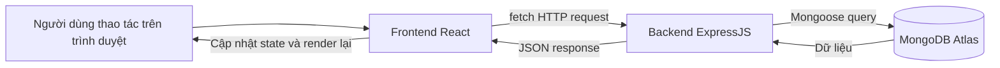
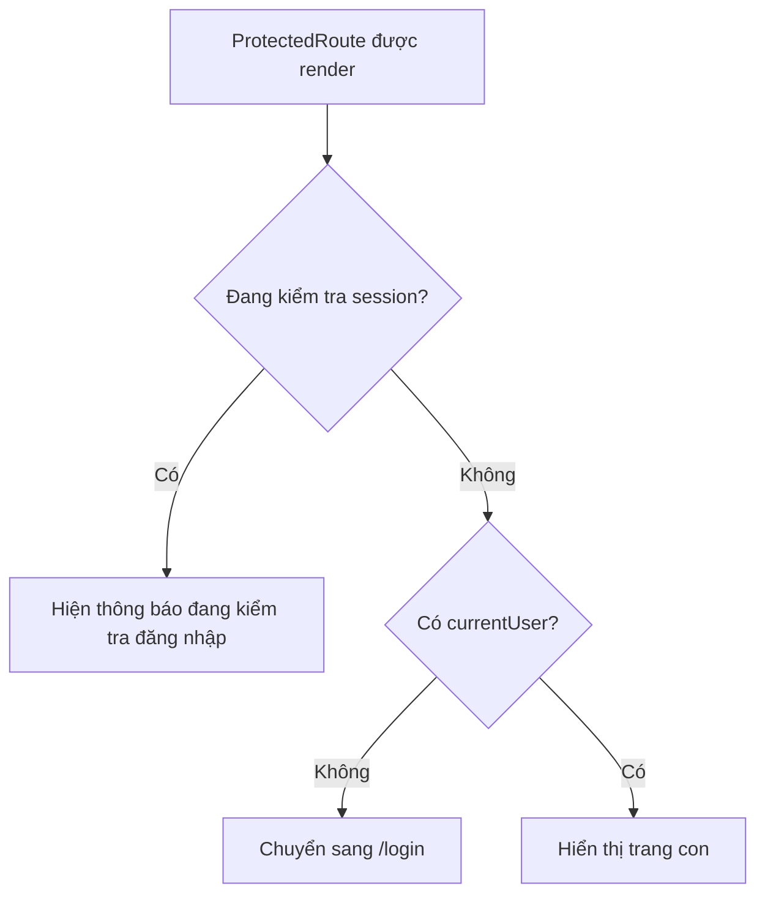
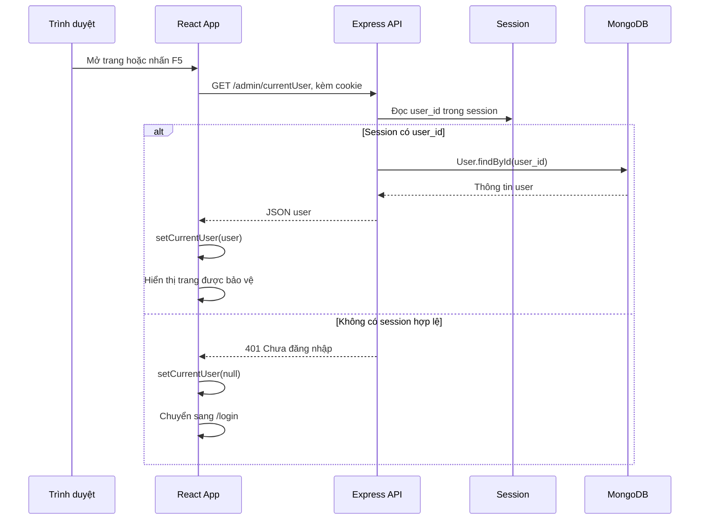
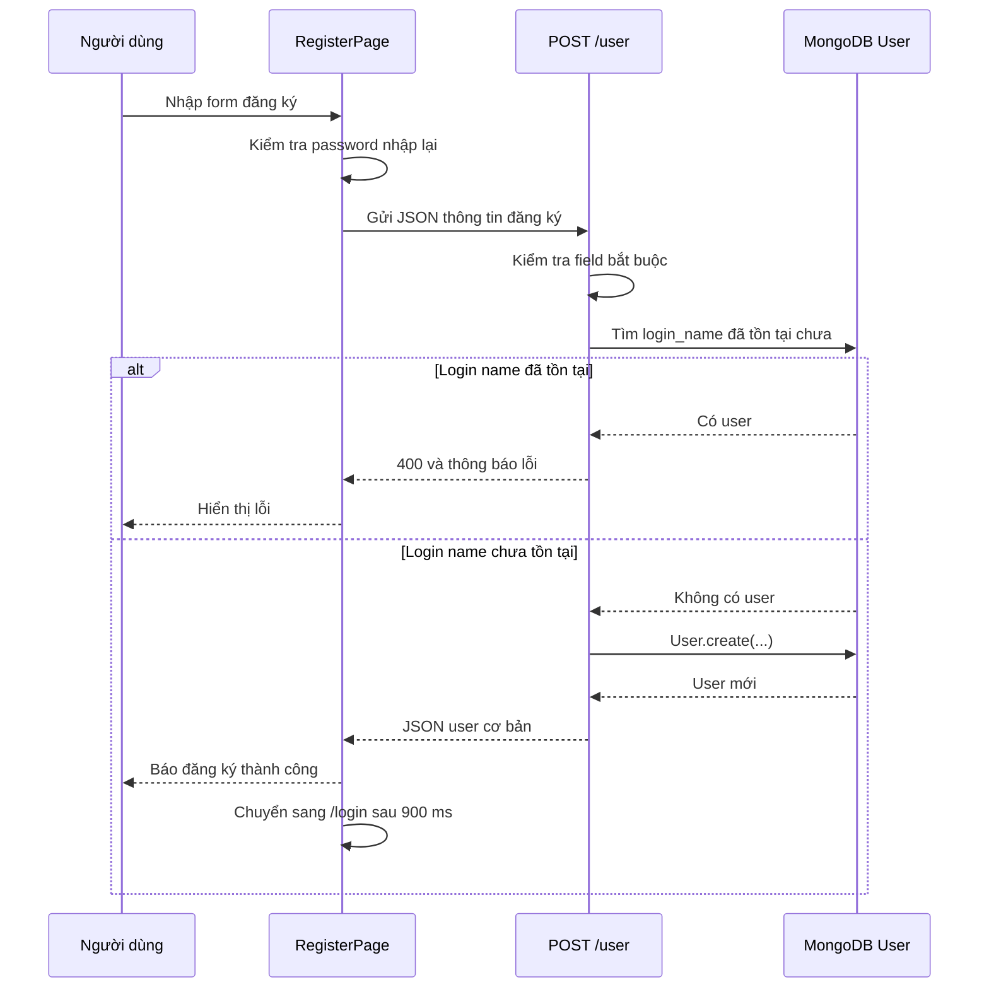
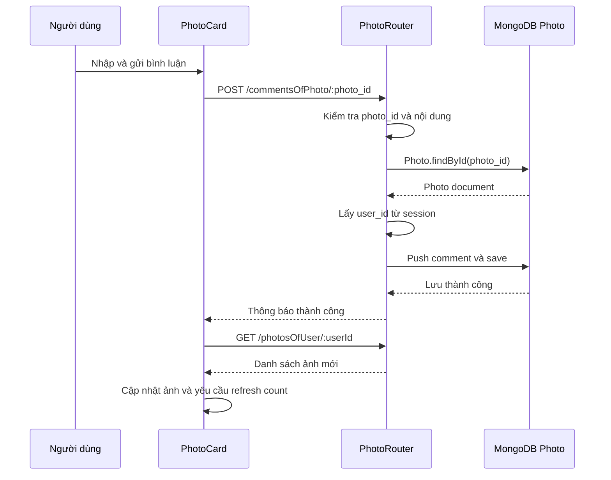
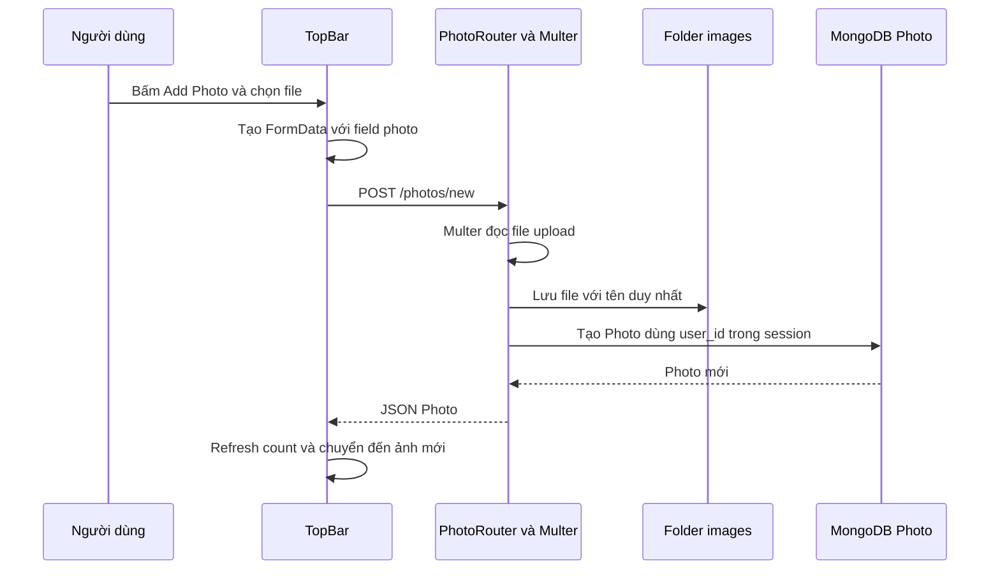

# Luồng hoạt động của website Photo Sharing

## 1. Mục đích của tài liệu

Tài liệu này giải thích cách website chia sẻ ảnh hoạt động từ lúc người dùng mở trang cho đến khi dữ liệu được đọc hoặc ghi vào MongoDB.

Nội dung được trình bày theo thứ tự:

1. Tổng quan hệ thống.
2. Vai trò của Frontend, Backend và Database.
3. Cách khởi động dự án.
4. Luồng khởi tạo ứng dụng React.
5. Cách Frontend Router chọn trang cần hiển thị.
6. Cách Frontend gọi API.
7. Cách Backend nhận request, kiểm tra đăng nhập và truy vấn Database.
8. Cấu trúc dữ liệu trong MongoDB.
9. Luồng chi tiết của từng chức năng từ cơ bản đến nâng cao.

Tài liệu ưu tiên giải thích dễ hiểu cho người mới học. Một số khái niệm kỹ thuật sẽ được giải thích ngay tại phần sử dụng.

---

## 2. Bức tranh tổng quan

Website được chia thành ba phần chính:

| Phần | Công nghệ | Vai trò |
| --- | --- | --- |
| Frontend, viết tắt là FE | React, React Router, JSX, CSS, `fetch` | Hiển thị giao diện và nhận thao tác của người dùng |
| Backend, viết tắt là BE | Node.js, ExpressJS, Mongoose, session, Multer | Cung cấp API, kiểm tra đăng nhập, xử lý nghiệp vụ |
| Database, viết tắt là DB | MongoDB Atlas | Lưu người dùng, ảnh, bình luận và thông tin schema |

Hai folder chính:

```text
photo-sharing-v1/     Frontend React
photo-sharing-be/     Backend ExpressJS và phần kết nối MongoDB
```

Luồng tổng quát:



Ví dụ đơn giản khi người dùng xem ảnh:

1. Người dùng bấm vào số ảnh của một user.
2. React Router chuyển URL trình duyệt sang `/photos/:userId`.
3. Component `UserPhotos` gọi API `GET /photosOfUser/:userId`.
4. Express nhận request và kiểm tra session đăng nhập.
5. Backend dùng Mongoose tìm ảnh trong MongoDB.
6. Backend trả JSON về Frontend.
7. Frontend lưu JSON vào state `photos`.
8. React render danh sách ảnh ra màn hình.

---

## 3. Phân biệt URL Frontend và URL Backend

Đây là điểm rất quan trọng khi trình bày hệ thống.

### 3.1. URL Frontend

Frontend mặc định chạy tại:

```text
http://localhost:3000
```

Các URL như dưới đây là URL để React Router quyết định trang nào cần hiển thị:

```text
http://localhost:3000/login
http://localhost:3000/users/USER_ID
http://localhost:3000/photos/USER_ID
```

Khi URL Frontend thay đổi, trình duyệt không nhất thiết phải tải lại toàn bộ website. React Router sẽ thay component ở vùng nội dung.

### 3.2. URL Backend

Backend mặc định chạy tại:

```text
http://localhost:8081
```

Các URL như dưới đây là API để Frontend lấy hoặc gửi dữ liệu:

```text
http://localhost:8081/admin/currentUser
http://localhost:8081/user/list
http://localhost:8081/photosOfUser/USER_ID
```

API thường trả dữ liệu JSON, không trả một trang giao diện React.

### 3.3. Ví dụ phân biệt

Khi người dùng mở:

```text
http://localhost:3000/users/123
```

React Router hiển thị component `UserDetail`. Sau đó `UserDetail` tự gọi:

```text
GET http://localhost:8081/user/123
```

Frontend URL dùng để chọn giao diện. Backend URL dùng để lấy dữ liệu cho giao diện đó.

---

## 4. Cấu trúc thư mục quan trọng

### 4.1. Frontend `photo-sharing-v1`

```text
photo-sharing-v1/
├── public/
│   ├── index.html
│   └── images/
├── src/
│   ├── components/
│   │   ├── LoginRegister/
│   │   ├── TopBar/
│   │   ├── UserComments/
│   │   ├── UserDetail/
│   │   ├── UserList/
│   │   └── UserPhotos/
│   ├── lib/
│   │   └── fetchModelData.js
│   ├── App.js
│   ├── App.css
│   ├── App.test.js
│   ├── index.js
│   └── index.css
└── package.json
```

Vai trò các file chính:

| File | Vai trò |
| --- | --- |
| `src/index.js` | Điểm bắt đầu của ứng dụng React |
| `src/App.js` | Quản lý đăng nhập, layout, Router và state dùng chung |
| `src/lib/fetchModelData.js` | Tập trung các hàm gọi API bằng `fetch` |
| `src/components/TopBar/index.jsx` | Thanh trên cùng, upload ảnh, logout, bật tính năng nâng cao |
| `src/components/LoginRegister/index.jsx` | Trang đăng nhập và đăng ký |
| `src/components/UserList/index.jsx` | Danh sách user, số ảnh và số bình luận |
| `src/components/UserDetail/index.jsx` | Thông tin chi tiết một user |
| `src/components/UserPhotos/index.jsx` | Danh sách ảnh, bình luận và chế độ nâng cao |
| `src/components/UserComments/index.jsx` | Các bình luận đã viết bởi một user |

### 4.2. Backend `photo-sharing-be`

```text
photo-sharing-be/
├── db/
│   ├── dbConnect.js
│   ├── dbLoad.js
│   ├── photoModel.js
│   ├── schemaInfo.js
│   └── userModel.js
├── images/
├── modelData/
│   └── models.js
├── routes/
│   ├── AdminRouter.js
│   ├── PhotoRouter.js
│   ├── RegisterRouter.js
│   └── UserRouter.js
├── .env
├── index.js
└── package.json
```

Vai trò các file chính:

| File | Vai trò |
| --- | --- |
| `index.js` | Khởi tạo server Express, middleware, session và gắn router |
| `db/dbConnect.js` | Kết nối MongoDB Atlas qua biến môi trường `DB_URL` |
| `db/userModel.js` | Mô tả cấu trúc document người dùng |
| `db/photoModel.js` | Mô tả cấu trúc document ảnh và bình luận |
| `db/schemaInfo.js` | Mô tả thông tin phiên bản dữ liệu |
| `db/dbLoad.js` | Xóa dữ liệu cũ và nạp dữ liệu mẫu vào MongoDB |
| `modelData/models.js` | Nguồn dữ liệu mẫu dùng cho quá trình seed |
| `routes/AdminRouter.js` | API đăng nhập, đăng xuất, lấy user hiện tại |
| `routes/RegisterRouter.js` | API đăng ký tài khoản |
| `routes/UserRouter.js` | API danh sách user và chi tiết user |
| `routes/PhotoRouter.js` | API ảnh, bình luận và upload ảnh |
| `images/` | Lưu file ảnh mẫu và ảnh upload |

---

## 5. Cách khởi động hệ thống

### 5.1. Chuẩn bị Database

Backend đọc địa chỉ MongoDB Atlas từ biến môi trường:

```text
DB_URL
```

Biến này được đặt trong file:

```text
photo-sharing-be/.env
```

Không nên ghi trực tiếp chuỗi kết nối MongoDB vào mã nguồn hoặc tài liệu công khai vì chuỗi kết nối có thể chứa tài khoản và mật khẩu.

### 5.2. Nạp dữ liệu mẫu

Từ folder Frontend có thể chạy:

```bash
npm run seed
```

Lệnh này thực chất chuyển sang folder Backend và chạy:

```bash
node ./db/dbLoad.js
```

Luồng seed:

1. `dbLoad.js` kết nối MongoDB Atlas.
2. Xóa dữ liệu cũ trong các collection User, Photo và SchemaInfo.
3. Đọc user và ảnh mẫu từ `modelData/models.js`.
4. Tạo `login_name` từ họ tên, ví dụ `Ian Malcolm` thành `ian_malcolm`.
5. Gán password mẫu là `password`.
6. Tạo user mới trong MongoDB và ghi nhớ ID thật do MongoDB sinh ra.
7. Tạo ảnh và thay ID giả trong dữ liệu mẫu bằng ID thật.
8. Gắn các bình luận vào đúng ảnh.
9. Tạo document `SchemaInfo`.
10. Ngắt kết nối MongoDB.

Tài khoản mẫu:

```text
login_name: ian_malcolm
password: password
```

### 5.3. Chạy Backend

Trong folder `photo-sharing-be`:

```bash
npm start
```

Backend chạy tại:

```text
http://localhost:8081
```

### 5.4. Chạy Frontend

Trong folder `photo-sharing-v1`:

```bash
npm start
```

Frontend chạy tại:

```text
http://localhost:3000
```

---

## 6. Luồng khởi tạo Frontend React

### 6.1. `public/index.html`

File HTML có một phần tử gốc:

```html
<div id="root"></div>
```

Ban đầu phần tử này rỗng. React sẽ render toàn bộ ứng dụng vào đây.

### 6.2. `src/index.js`

`src/index.js` là điểm bắt đầu của Frontend:

```jsx
const root = ReactDOM.createRoot(document.getElementById("root"));
root.render(
  <React.StrictMode>
    <App />
  </React.StrictMode>
);
```

Ý nghĩa:

1. Tìm phần tử HTML có ID là `root`.
2. Tạo React root.
3. Render component `App`.
4. Từ `App`, các component còn lại mới được render tiếp.

### 6.3. `App` bọc ứng dụng bằng `BrowserRouter`

Trong `src/App.js`:

```jsx
function App() {
  return (
    <Router>
      <AppContent />
    </Router>
  );
}
```

`Router` là tên đổi lại của `BrowserRouter`.

`BrowserRouter` cho phép ứng dụng:

- Đọc URL hiện tại của trình duyệt.
- Chuyển URL bằng `Link`, `Navigate` hoặc `useNavigate`.
- Hiển thị component phù hợp với URL mà không tải lại toàn bộ trang.

`AppContent` được đặt bên trong `Router` vì nó sử dụng `useNavigate`. Hook này chỉ hoạt động khi component nằm trong Router.

---

## 7. Kiến thức nền tảng về React Router

### 7.1. Route là gì?

Một `Route` là quy tắc:

> Nếu URL có dạng này thì hiển thị component này.

Ví dụ:

```jsx
<Route path="/users/:userId" element={<UserDetail />} />
```

Nếu URL là:

```text
/users/abc123
```

thì React Router hiển thị `UserDetail`, đồng thời coi:

```text
userId = "abc123"
```

Phần bắt đầu bằng dấu `:` là tham số động.

### 7.2. `Routes` là gì?

`Routes` chứa danh sách các `Route`. React Router sẽ tìm route phù hợp với URL hiện tại.

### 7.3. `Link` là gì?

`Link` tạo liên kết điều hướng trong ứng dụng React:

```jsx
<Link to={`/users/${user._id}`}>Tên user</Link>
```

Khi bấm `Link`, URL thay đổi nhưng ứng dụng không cần tải lại toàn bộ trang như thẻ `<a>` thông thường.

### 7.4. `useNavigate` là gì?

`useNavigate` dùng khi cần chuyển trang bằng JavaScript sau một hành động.

Ví dụ sau khi đăng nhập thành công:

```jsx
navigate(`/users/${user._id}`);
```

### 7.5. `Navigate` là gì?

`Navigate` là component dùng để chuyển hướng trong lúc render.

Ví dụ nếu chưa đăng nhập:

```jsx
return <Navigate to="/login" replace />;
```

`replace` thay URL hiện tại trong lịch sử trình duyệt, giúp nút Back không quay về trang không hợp lệ ngay trước đó.

### 7.6. `useParams` là gì?

`useParams` lấy tham số động từ URL.

Ví dụ URL:

```text
/photos/abc123/photo456
```

Với route:

```text
/photos/:userId/:photoId
```

thì:

```js
userId = "abc123";
photoId = "photo456";
```

### 7.7. `useLocation` và `matchPath` là gì?

`TopBar` dùng:

- `useLocation()` để đọc URL hiện tại.
- `matchPath()` để kiểm tra URL thuộc trang ảnh, trang bình luận hay trang user.

Nhờ đó tiêu đề trên TopBar thay đổi theo trang đang xem, ví dụ:

```text
Ảnh của Ian Malcolm
Bình luận của Ian Malcolm
Ian Malcolm
```

---

## 8. Toàn bộ Frontend Router trong `App.js`

### 8.1. Bảng route

| URL Frontend | Component chính | Điều kiện |
| --- | --- | --- |
| `/login` | `LoginPage` | Chỉ dành cho người chưa đăng nhập |
| `/register` | `RegisterPage` | Chỉ dành cho người chưa đăng nhập |
| `/` | Chuyển hướng | Sang trang user hiện tại hoặc `/login` |
| `/users` | `UserList` | Phải đăng nhập |
| `/users/:userId` | `UserDetail` | Phải đăng nhập |
| `/comments/:userId` | `UserComments` | Phải đăng nhập |
| `/photos/:userId` | `UserPhotos` | Phải đăng nhập |
| `/photos/:userId/:photoId` | `UserPhotos` | Phải đăng nhập |

### 8.2. `ProtectedRoute`

`ProtectedRoute` bảo vệ các trang chỉ dành cho người đã đăng nhập.

Luồng xử lý:



Mục đích của `checkingLogin` là tránh chuyển người dùng về `/login` quá sớm trong lúc Frontend chưa hỏi Backend xem session cũ còn tồn tại hay không.

### 8.3. `PublicOnlyRoute`

`PublicOnlyRoute` dùng cho `/login` và `/register`.

Nếu người dùng đã đăng nhập mà vẫn mở `/login`, ứng dụng chuyển họ về:

```text
/users/:currentUserId
```

Điều này giải quyết trường hợp nhấn F5 ở trang login nhưng session vẫn còn: user không bị giữ lại ở trang login.

### 8.4. Route `/`

Route gốc `/` không hiển thị một trang riêng. Nó kiểm tra:

- Nếu đã đăng nhập: chuyển đến trang chi tiết của user hiện tại.
- Nếu chưa đăng nhập: chuyển đến `/login`.

### 8.5. Hai route ảnh

Ứng dụng có hai route cùng hiển thị `UserPhotos`:

```text
/photos/:userId
/photos/:userId/:photoId
```

Ý nghĩa:

- `/photos/:userId`: xem toàn bộ ảnh của user ở chế độ thường.
- `/photos/:userId/:photoId`: xem một ảnh cụ thể ở chế độ nâng cao.

Route có `photoId` giúp người dùng bookmark hoặc chia sẻ đường dẫn đến đúng một ảnh.

### 8.6. Layout bao quanh Router

`TopBar` luôn được render.

Sidebar `UserList` chỉ được render khi có `currentUser`:

```jsx
{currentUser && (
  <aside className="sidebar">
    <UserList refreshKey={userListRefreshKey} />
  </aside>
)}
```

Phần `<Routes>` nằm trong vùng nội dung chính. Vì vậy khi URL thay đổi, vùng nội dung thay đổi nhưng TopBar và sidebar vẫn giữ nguyên.

---

## 9. State dùng chung trong `App.js`

`AppContent` quản lý các state quan trọng:

| State | Ý nghĩa |
| --- | --- |
| `currentUser` | User đang đăng nhập; `null` nghĩa là chưa đăng nhập |
| `checkingLogin` | Frontend đang hỏi Backend xem session có còn hợp lệ không |
| `advancedEnabled` | Checkbox tính năng nâng cao đang bật hay tắt |
| `userListRefreshKey` | Số dùng để yêu cầu `UserList` tải lại count |

### 9.1. Vì sao đặt state ở `App.js`?

`App.js` là component cha của TopBar, UserList và các trang nội dung. Khi nhiều component cần dùng chung dữ liệu, đặt state ở component cha giúp truyền dữ liệu xuống bằng props.

Ví dụ:

- TopBar cần biết `currentUser` để hiện nút Logout.
- Sidebar cần biết khi nào count phải cập nhật.
- UserPhotos cần biết `advancedEnabled`.

### 9.2. `userListRefreshKey` cập nhật count ngay sau thao tác

Sau khi upload ảnh hoặc thêm bình luận:

```js
setUserListRefreshKey((current) => current + 1);
```

`UserList` nhận `refreshKey` qua props và có `useEffect` phụ thuộc vào giá trị này:

```js
useEffect(() => {
  loadUsers();
}, [refreshKey]);
```

Mỗi lần key tăng, `UserList` gọi lại API `/user/list`, nên số ảnh và số bình luận cập nhật mà không cần F5.

Đây là cập nhật ngay trong phiên sử dụng hiện tại sau hành động của người dùng. Hệ thống chưa dùng WebSocket, vì vậy nếu một trình duyệt khác thay đổi dữ liệu thì trình duyệt hiện tại không tự nhận thay đổi ngay lập tức.

---

## 10. Luồng kiểm tra đăng nhập khi mở hoặc F5 trang

Khi `AppContent` được render lần đầu, `useEffect` gọi:

```text
GET /admin/currentUser
```

Luồng đầy đủ:



Điểm quan trọng:

- Session nằm ở Backend.
- Trình duyệt giữ cookie nhận diện session.
- Frontend dùng `credentials: "include"` để gửi cookie khi gọi API.
- Vì vậy nhấn F5 không làm mất đăng nhập nếu session Backend vẫn còn.

---

## 11. Lớp gọi API của Frontend

File:

```text
src/lib/fetchModelData.js
```

File này giúp các component không phải lặp lại cấu hình `fetch`.

### 11.1. `API_BASE`

Trong môi trường development:

```text
API_BASE = http://localhost:8081
```

Nếu có biến môi trường `REACT_APP_API_BASE`, ứng dụng sẽ ưu tiên dùng biến đó.

### 11.2. `fetchModel(url)`

Dùng cho request GET:

```js
fetchModel("/user/list");
```

Hàm sẽ gọi:

```text
GET http://localhost:8081/user/list
```

### 11.3. `postJson(url, data)`

Dùng cho request POST gửi JSON:

```js
postJson("/admin/login", {
  login_name: loginName,
  password,
});
```

Hàm tự:

- Đặt method là `POST`.
- Đặt header `Content-Type: application/json`.
- Chuyển object JavaScript thành chuỗi JSON bằng `JSON.stringify`.

### 11.4. `postForm(url, formData)`

Dùng khi upload file ảnh:

```js
postForm("/photos/new", formData);
```

Không tự đặt `Content-Type` vì trình duyệt cần tự thêm boundary cho dữ liệu `multipart/form-data`.

### 11.5. `credentials: "include"`

Cả GET và POST đều có:

```js
credentials: "include"
```

Tùy chọn này yêu cầu trình duyệt gửi cookie session đến Backend. Nếu thiếu nó, Backend có thể coi request là chưa đăng nhập.

### 11.6. `imageUrl(fileName)`

Ảnh không được đọc trực tiếp từ MongoDB. MongoDB chỉ lưu tên file.

Frontend tạo URL ảnh:

```text
http://localhost:8081/images/TEN_FILE
```

Backend phục vụ file thật từ folder `photo-sharing-be/images`.

---

## 12. Luồng khởi tạo Backend ExpressJS

File bắt đầu của Backend:

```text
photo-sharing-be/index.js
```

Thứ tự middleware trong Express rất quan trọng vì request đi từ trên xuống dưới.

### 12.1. Kết nối MongoDB

Backend gọi:

```js
dbConnect();
```

`dbConnect.js`:

1. Đọc `DB_URL` từ `.env`.
2. Gọi `mongoose.connect(dbUrl)`.
3. Nếu thành công, Backend có thể truy vấn MongoDB bằng các model Mongoose.

### 12.2. CORS

Backend cấu hình:

```js
cors({
  origin: "http://localhost:3000",
  credentials: true,
})
```

CORS cho phép Frontend ở cổng `3000` gọi Backend ở cổng `8081`.

Hai cổng khác nhau được trình duyệt coi là hai origin khác nhau. Vì có session cookie nên cả Frontend và Backend đều phải bật credentials.

### 12.3. `express.json()`

Middleware này đọc request body dạng JSON.

Ví dụ Frontend gửi:

```json
{
  "login_name": "ian_malcolm",
  "password": "password"
}
```

Sau `express.json()`, Backend có thể đọc bằng:

```js
request.body.login_name
```

### 12.4. Session

Backend dùng `express-session`:

```js
session({
  secret: process.env.SESSION_SECRET || "photo-sharing-secret",
  resave: false,
  saveUninitialized: false,
})
```

Hiểu đơn giản:

- Sau khi đăng nhập đúng, Backend lưu `user_id` vào session.
- Trình duyệt nhận một cookie nhận diện session đó.
- Các request sau gửi cookie lên.
- Backend đọc cookie để biết ai đang đăng nhập.

Ứng dụng không gửi `user_id` từ Frontend mỗi lần thêm bình luận hoặc upload ảnh. Backend lấy user hiện tại từ session, an toàn hơn việc tin vào ID do Frontend gửi.

### 12.5. Phục vụ file ảnh tĩnh

```js
app.use("/images", express.static(path.join(__dirname, "images")));
```

Ví dụ request:

```text
GET /images/malcolm1.jpg
```

sẽ đọc file:

```text
photo-sharing-be/images/malcolm1.jpg
```

### 12.6. Router công khai và router được bảo vệ

Thứ tự gắn router:

```js
app.use(AdminRouter);
app.use(RegisterRouter);
app.use(requireLogin);
app.use(UserRouter);
app.use(PhotoRouter);
```

Ý nghĩa:

- API đăng nhập, đăng xuất, kiểm tra user hiện tại và đăng ký được gắn trước `requireLogin`.
- API user, ảnh và bình luận được gắn sau `requireLogin`, nên bắt buộc phải đăng nhập.

### 12.7. `requireLogin`

Middleware:

```js
if (!request.session.user_id) {
  response.status(401).json({ error: "Bạn cần đăng nhập trước." });
  return;
}
next();
```

Nếu không có `user_id` trong session:

- Backend trả HTTP status `401`.
- Request dừng lại.
- Router phía sau không được chạy.

Nếu có session:

- Gọi `next()`.
- Request tiếp tục đi đến `UserRouter` hoặc `PhotoRouter`.

---

## 13. Kiến thức nền tảng về Backend Router

### 13.1. Express Router là gì?

Router là nơi gom các API cùng nhóm.

Ví dụ `UserRouter.js` chứa các API liên quan đến user:

```text
GET /user/list
GET /user/:id
```

`PhotoRouter.js` chứa các API liên quan đến ảnh và bình luận:

```text
GET /photosOfUser/:id
GET /commentsOfUser/:id
POST /commentsOfPhoto/:photo_id
POST /photos/new
```

### 13.2. Request và response

Mỗi API thường có dạng:

```js
router.get("/user/:id", async (request, response) => {
  // Đọc dữ liệu từ request
  // Truy vấn database
  // Trả dữ liệu bằng response
});
```

Các nguồn dữ liệu thường dùng:

| Vị trí | Ví dụ | Cách đọc |
| --- | --- | --- |
| Tham số trong URL | `/user/:id` | `request.params.id` |
| JSON body | `{ "comment": "Đẹp quá" }` | `request.body.comment` |
| Session | User đang đăng nhập | `request.session.user_id` |
| File upload | Form field tên `photo` | `request.file` |

### 13.3. HTTP method

| Method | Mục đích trong dự án |
| --- | --- |
| `GET` | Đọc dữ liệu |
| `POST` | Tạo dữ liệu hoặc thực hiện hành động như login, logout |

### 13.4. HTTP status

| Status | Ý nghĩa trong dự án |
| --- | --- |
| `200` | Thành công |
| `400` | Dữ liệu gửi lên không hợp lệ hoặc không tìm thấy đối tượng |
| `401` | Chưa đăng nhập hoặc session không hợp lệ |
| `500` | Lỗi xử lý phía Backend |

---

## 14. Database và Mongoose

### 14.1. MongoDB lưu dữ liệu như thế nào?

MongoDB lưu dữ liệu theo:

```text
Database
└── Collection
    └── Document
```

Có thể hiểu gần giống:

| MongoDB | Cách hình dung gần giống SQL |
| --- | --- |
| Collection | Bảng |
| Document | Một dòng dữ liệu |
| Field | Một cột |

Tuy nhiên document MongoDB có thể chứa object hoặc mảng lồng nhau, ví dụ một ảnh chứa luôn mảng bình luận.

### 14.2. Mongoose là gì?

Mongoose là thư viện giúp Node.js làm việc với MongoDB.

Trong dự án:

- Schema mô tả các field của document.
- Model cung cấp các hàm như `find`, `findOne`, `findById`, `create`, `save`.

Ví dụ:

```js
const user = await User.findById(id).lean();
```

### 14.3. Vì sao dùng `.lean()`?

`lean()` yêu cầu Mongoose trả object JavaScript đơn giản thay vì document Mongoose đầy đủ.

Điều này phù hợp với các API chỉ cần đọc dữ liệu rồi trả JSON, giúp dữ liệu nhẹ và dễ xử lý hơn.

### 14.4. `ObjectId`

MongoDB tạo `_id` dạng `ObjectId` cho mỗi document.

Backend kiểm tra ID trước khi truy vấn:

```js
mongoose.Types.ObjectId.isValid(id)
```

Việc này tránh gửi một chuỗi ID sai định dạng vào MongoDB.

---

## 15. Cấu trúc dữ liệu trong MongoDB

### 15.1. User

Model:

```text
photo-sharing-be/db/userModel.js
```

Một document user có dạng:

```json
{
  "_id": "ObjectId",
  "login_name": "ian_malcolm",
  "password": "password",
  "first_name": "Ian",
  "last_name": "Malcolm",
  "location": "Austin, TX",
  "description": "Should've stayed in the car.",
  "occupation": "Mathematician"
}
```

Ý nghĩa:

| Field | Ý nghĩa |
| --- | --- |
| `_id` | ID do MongoDB tạo |
| `login_name` | Tên đăng nhập |
| `password` | Mật khẩu |
| `first_name`, `last_name` | Họ tên |
| `location` | Địa điểm |
| `description` | Mô tả |
| `occupation` | Nghề nghiệp |

Lưu ý: Dự án hiện lưu password dạng chuỗi đơn giản theo yêu cầu bài học. Trong hệ thống thực tế, password phải được băm bằng thư viện như `bcrypt`, không lưu dạng rõ.

### 15.2. Photo

Model:

```text
photo-sharing-be/db/photoModel.js
```

Một document ảnh có dạng:

```json
{
  "_id": "ObjectId",
  "file_name": "malcolm1.jpg",
  "date_time": "Date",
  "user_id": "ObjectId của chủ ảnh",
  "comments": []
}
```

Backend chỉ lưu tên file vào MongoDB. File ảnh thật nằm trong folder `images`.

### 15.3. Comment là dữ liệu lồng trong Photo

Comment không có collection riêng. Mỗi comment nằm trong mảng `comments` của một document Photo:

```json
{
  "comment": "Nội dung bình luận",
  "date_time": "Date",
  "user_id": "ObjectId của người viết"
}
```

Quan hệ dữ liệu:


### 15.4. SchemaInfo

`SchemaInfo` lưu:

```json
{
  "version": "1.0",
  "load_date_time": "Date"
}
```

API `/test/info` dùng để đọc thông tin này.

### 15.5. Count không được lưu cố định

Số ảnh và số bình luận trong danh sách user không phải field của User.

Mỗi lần gọi `/user/list`, Backend:

1. Đọc toàn bộ user.
2. Đọc các ảnh và `comments.user_id`.
3. Đếm số ảnh theo `photo.user_id`.
4. Đếm số bình luận theo `comment.user_id`.
5. Ghép count vào dữ liệu trả về.

Ưu điểm: count luôn dựa trên dữ liệu thật, không bị lệch vì quên cập nhật một field count.

---

## 16. DTO và lý do không trả toàn bộ dữ liệu

DTO là object được tạo riêng để trả về Frontend, chỉ chứa dữ liệu cần thiết.

Ví dụ khi đăng nhập, Backend không trả password:

```js
{
  _id,
  login_name,
  first_name,
  last_name
}
```

Ví dụ danh sách user chỉ cần:

```js
{
  _id,
  first_name,
  last_name,
  photo_count,
  comment_count
}
```

Lợi ích:

- Không làm lộ dữ liệu nhạy cảm như password.
- JSON nhỏ hơn.
- Frontend nhận đúng dữ liệu cần hiển thị.
- Dễ kiểm soát cấu trúc API.

---

## 17. Danh sách API Backend

| Method | API | Đăng nhập? | Mục đích |
| --- | --- | --- | --- |
| `POST` | `/admin/login` | Không | Đăng nhập |
| `POST` | `/admin/logout` | Không, nhưng cần session đang tồn tại | Đăng xuất |
| `GET` | `/admin/currentUser` | Kiểm tra session | Lấy user hiện tại |
| `POST` | `/user` | Không | Đăng ký user |
| `GET` | `/user/list` | Có | Lấy danh sách user và count |
| `GET` | `/user/:id` | Có | Lấy chi tiết một user |
| `GET` | `/photosOfUser/:id` | Có | Lấy ảnh và bình luận của user |
| `GET` | `/commentsOfUser/:id` | Có | Lấy các bình luận do user viết |
| `POST` | `/commentsOfPhoto/:photo_id` | Có | Thêm bình luận vào ảnh |
| `POST` | `/photos/new` | Có | Upload ảnh mới |
| `GET` | `/images/:fileName` | Không | Đọc file ảnh tĩnh |
| `GET` | `/test/info` | Có | Đọc thông tin schema |

---

## 18. Luồng chức năng đăng ký

Frontend component:

```text
LoginRegister/RegisterPage
```

Backend router:

```text
RegisterRouter.js
```

Database model:

```text
User
```

Luồng:



Chi tiết:

1. Người dùng mở `/register`.
2. `PublicOnlyRoute` chỉ cho xem trang nếu chưa đăng nhập.
3. `RegisterPage` lưu các ô nhập trong state `registerForm`.
4. Khi submit, Frontend kiểm tra password và confirm password.
5. Frontend gọi `postJson("/user", data)`.
6. Backend kiểm tra các field bắt buộc không được rỗng.
7. Backend kiểm tra `login_name` đã tồn tại chưa.
8. Nếu hợp lệ, Backend tạo document User trong MongoDB.
9. Frontend hiển thị thông báo thành công và chuyển về trang login.

---

## 19. Luồng chức năng đăng nhập

Frontend component:

```text
LoginRegister/LoginPage
```

Backend router:

```text
AdminRouter.js
```

Luồng:



```mermaid
sequenceDiagram
    participant U as Người dùng
    participant FE as LoginPage
    participant BE as POST /admin/login
    participant DB as MongoDB User
    participant S as Session

    U->>FE: Nhập login name và password
    FE->>BE: Gửi JSON đăng nhập
    BE->>DB: User.findOne({ login_name })
    DB-->>BE: User hoặc null
    BE->>BE: So sánh password
    alt Sai thông tin
        BE-->>FE: 400 và thông báo lỗi
        FE-->>U: Hiển thị lỗi
    else Đúng thông tin
        BE->>S: Lưu session.user_id
        BE-->>FE: Trả DTO user, không có password
        FE->>FE: setCurrentUser(user)
        FE->>FE: Chuyển sang /users/:userId
    end
```

Sau đăng nhập thành công:

- TopBar hiện lời chào, Add Photo, Logout và checkbox nâng cao.
- Sidebar `UserList` xuất hiện.
- Các route được bảo vệ có thể truy cập.

---

## 20. Luồng chức năng đăng xuất

1. Người dùng bấm nút Logout trong `TopBar`.
2. `TopBar` gọi prop `onLogout`.
3. `App.js` gọi:

```text
POST /admin/logout
```

4. Backend gọi `request.session.destroy(...)`.
5. Frontend đặt `currentUser` thành `null`.
6. Frontend chuyển sang `/login`.
7. Sidebar biến mất vì không còn `currentUser`.

Ngay cả khi session đã hết hạn và API logout báo lỗi, Frontend vẫn đưa người dùng về trang login.

---

## 21. Luồng hiển thị danh sách người dùng và count

Frontend component:

```text
UserList
```

Backend API:

```text
GET /user/list
```

Luồng Backend:

1. Đọc danh sách user với các field `_id`, `first_name`, `last_name`.
2. Đọc tất cả ảnh với `user_id` và `comments.user_id`.
3. Tạo object `photoCountByUser`.
4. Tạo object `commentCountByUser`.
5. Duyệt ảnh để đếm số ảnh của mỗi chủ ảnh.
6. Duyệt bình luận trong từng ảnh để đếm số bình luận của mỗi người viết.
7. Trả danh sách user đã gắn `photo_count` và `comment_count`.

Luồng Frontend:

1. `UserList` gọi `fetchModel("/user/list")`.
2. Lưu kết quả vào state `users`.
3. Render tên user.
4. Render count ảnh màu xanh, liên kết đến `/photos/:userId`.
5. Render count bình luận màu đỏ, liên kết đến `/comments/:userId`.

`useRef` tên `hasLoadedRef` giúp chỉ hiện thông báo loading lớn ở lần tải đầu. Khi count được refresh, giao diện cũ vẫn được giữ trong lúc chờ dữ liệu mới.

---

## 22. Luồng xem chi tiết người dùng

URL Frontend:

```text
/users/:userId
```

Frontend component:

```text
UserDetail
```

Backend API:

```text
GET /user/:id
```

Luồng:

1. Người dùng bấm tên một user trong `UserList`.
2. `Link` đổi URL sang `/users/:userId`.
3. React Router render `UserDetail`.
4. `UserDetail` dùng `useParams()` lấy `userId`.
5. `useEffect` gọi API `/user/:userId`.
6. Backend kiểm tra ID có đúng định dạng ObjectId không.
7. Backend dùng `User.findById(...)`.
8. Backend chỉ lấy các field cần hiển thị.
9. Frontend render họ tên, địa điểm, nghề nghiệp và mô tả.
10. Nút `Xem ảnh` dẫn đến `/photos/:userId`.

---

## 23. Luồng xem ảnh và bình luận

URL Frontend:

```text
/photos/:userId
```

Frontend component:

```text
UserPhotos
```

Backend API:

```text
GET /photosOfUser/:id
```

### 23.1. Backend lấy ảnh

1. Kiểm tra `id` có phải ObjectId hợp lệ.
2. Kiểm tra user có tồn tại.
3. Tìm các Photo có `user_id` bằng ID user.
4. Duyệt các bình luận để thu thập ID người viết.
5. Tìm thông tin tên của các user đã bình luận.
6. Tạo `userMap` để tra user theo ID nhanh hơn.
7. Tạo JSON kết quả, thay `comment.user_id` bằng object user tối thiểu.
8. Trả danh sách ảnh về Frontend.

### 23.2. Vì sao Backend phải ghép user vào comment?

Trong MongoDB, comment chỉ lưu:

```text
user_id
```

Nhưng giao diện cần hiển thị:

```text
Ian Malcolm
```

Vì vậy Backend tìm User tương ứng rồi trả:

```json
{
  "user": {
    "_id": "...",
    "first_name": "Ian",
    "last_name": "Malcolm"
  }
}
```

Frontend không cần tự gọi thêm API cho từng bình luận.

### 23.3. Frontend render ảnh

1. `UserPhotos` dùng `useParams()` lấy `userId`.
2. `useEffect` gọi API khi `userId` thay đổi.
3. Trong lúc chờ, hiện `Đang tải...`.
4. Nếu API lỗi, hiện thông báo lỗi.
5. Nếu danh sách rỗng, hiện `Người dùng này chưa đăng ảnh nào.`.
6. Nếu có ảnh, render `PhotoCard`.

Mỗi `PhotoCard`:

- Tạo URL ảnh bằng `imageUrl(photo.file_name)`.
- Hiển thị thời gian tạo ảnh.
- Hiển thị danh sách bình luận.
- Tạo `Link` từ tên người bình luận đến trang chi tiết user.
- Hiển thị form thêm bình luận.

---

## 24. Luồng thêm bình luận

Frontend:

```text
PhotoCard trong UserPhotos
```

Backend API:

```text
POST /commentsOfPhoto/:photo_id
```

Luồng:



Điểm quan trọng:

- Frontend chỉ gửi nội dung `comment`.
- Backend lấy người viết từ `request.session.user_id`.
- Sau khi thêm thành công, Frontend tải lại ảnh để bình luận mới xuất hiện.
- `onDataChanged()` làm `userListRefreshKey` tăng.
- `UserList` tải lại `/user/list`, nên số bình luận màu đỏ cập nhật không cần F5.

---

## 25. Luồng xem các bình luận đã viết

URL Frontend:

```text
/comments/:userId
```

Frontend component:

```text
UserComments
```

Backend API:

```text
GET /commentsOfUser/:id
```

Luồng Backend:

1. Kiểm tra ID user.
2. Kiểm tra user có tồn tại.
3. Tìm các ảnh có ít nhất một comment mang `user_id` cần tìm:

```js
Photo.find({ "comments.user_id": id })
```

4. Duyệt từng ảnh.
5. Lọc đúng các comment do user đó viết.
6. Trả mỗi comment cùng thông tin ảnh chứa comment.

Luồng Frontend:

1. `UserComments` lấy `userId` từ URL.
2. Gọi `/commentsOfUser/:userId`.
3. Nếu rỗng, hiện thông báo user chưa viết bình luận.
4. Nếu có dữ liệu, hiển thị ảnh thu nhỏ và nội dung comment.
5. Mỗi mục là `Link` đến:

```text
/photos/:photoOwnerId/:photoId
```

Nhờ `photoId`, người dùng có thể đến đúng ảnh chứa bình luận.

---

## 26. Luồng upload ảnh

Frontend:

```text
TopBar
```

Backend API:

```text
POST /photos/new
```

Thư viện Backend:

```text
Multer
```

Luồng:



Chi tiết:

1. Input file thật được ẩn bằng CSS.
2. Nút Add Photo gọi `fileInputRef.current.click()`.
3. Khi người dùng chọn file, Frontend tạo `FormData`.
4. Field file có tên `photo`.
5. Backend dùng `upload.single("photo")`, nên tên field phải khớp chính xác.
6. Multer lưu file vào `photo-sharing-be/images`.
7. Tên file được tạo từ thời gian hiện tại và số ngẫu nhiên để giảm trùng tên.
8. Backend tạo document Photo với:
   - `file_name` là tên file đã lưu.
   - `date_time` là thời gian hiện tại.
   - `user_id` lấy từ session.
   - `comments` là mảng rỗng.
9. Frontend tăng `userListRefreshKey` để số ảnh màu xanh cập nhật.
10. Frontend chuyển đến URL ảnh mới.

---

## 27. Luồng bật và tắt tính năng nâng cao

Checkbox nằm trong `TopBar`.

State gốc:

```text
advancedEnabled trong App.js
```

State hiển thị trong trang ảnh:

```text
showAdvanced trong UserPhotos
```

Luồng khi tick hoặc bỏ tick:

1. Người dùng thay đổi checkbox.
2. `TopBar` gọi:

```js
onAdvancedChange(event.target.checked)
```

3. `App.js` cập nhật `advancedEnabled`.
4. Giá trị mới được truyền xuống `UserPhotos` qua props.
5. `UserPhotos` dùng `useEffect` đồng bộ `showAdvanced`.
6. React render lại giao diện ngay lập tức.

### 27.1. Khi bật tính năng nâng cao

Nếu URL hiện tại chưa có `photoId`:

```text
/photos/:userId
```

thì `UserPhotos` tự chuyển đến ảnh đầu tiên:

```text
/photos/:userId/:firstPhotoId
```

Giao diện chỉ hiện một ảnh và có nút:

```text
Trước | Ảnh hiện tại / Tổng số ảnh | Sau
```

### 27.2. Khi tắt tính năng nâng cao

Nếu URL đang có `photoId`, ứng dụng chuyển về:

```text
/photos/:userId
```

Giao diện trở lại danh sách toàn bộ ảnh.

### 27.3. `useMemo` chọn vị trí ảnh hiện tại

`currentIndex` được tính từ `photoId`:

1. Nếu không có `photoId`, dùng ảnh đầu tiên.
2. Nếu có `photoId`, tìm vị trí ảnh tương ứng trong mảng `photos`.
3. Nếu không tìm thấy, quay về vị trí đầu tiên.

Từ `currentIndex`, ứng dụng tìm được ảnh trước và ảnh sau để bật hoặc vô hiệu hóa nút điều hướng.

---

## 28. Luồng tiêu đề động trên TopBar

`TopBar` cần hiển thị tiêu đề phù hợp với trang đang xem.

Luồng:

1. `useLocation()` lấy `location.pathname`.
2. `matchPath()` kiểm tra pathname thuộc route nào.
3. Lấy `userId` từ route.
4. Gọi API:

```text
GET /user/:userId
```

5. Ghép `first_name` và `last_name`.
6. Hiển thị tiêu đề theo loại trang.

Ví dụ:

| URL | Tiêu đề |
| --- | --- |
| `/users/ID` | `Ian Malcolm` |
| `/photos/ID` | `Ảnh của Ian Malcolm` |
| `/comments/ID` | `Bình luận của Ian Malcolm` |
| `/users` | `Người dùng` |

---

## 29. Xử lý loading, dữ liệu rỗng và lỗi

Các component lấy dữ liệu thường có ba loại state:

```js
const [data, setData] = useState(...);
const [isLoading, setIsLoading] = useState(true);
const [error, setError] = useState("");
```

Thứ tự hiển thị nên là:

1. Nếu có lỗi: hiện lỗi.
2. Nếu đang tải: hiện `Đang tải...`.
3. Nếu tải xong nhưng mảng rỗng: hiện thông báo không có dữ liệu.
4. Nếu có dữ liệu: render dữ liệu.

Ví dụ trong trang ảnh:

```text
Đang tải...                         Khi request chưa xong
Người dùng này chưa đăng ảnh nào.   Khi request xong và mảng rỗng
Danh sách ảnh                       Khi có dữ liệu
```

Điều này tránh lỗi giao diện hiện `Đang tải...` mãi khi user chưa có ảnh hoặc chưa có bình luận.

### 29.1. Biến `ignore` trong `useEffect`

Nhiều component có dạng:

```js
let ignore = false;

return () => {
  ignore = true;
};
```

Mục đích:

- Nếu component bị unmount trước khi API trả về, không cập nhật state của component đã biến mất.
- Giảm cảnh báo và lỗi do request bất đồng bộ trả về muộn.

---

## 30. Luồng dữ liệu theo từng component Frontend

| Component | Nhận từ đâu | API gọi | State chính | Kết quả hiển thị |
| --- | --- | --- | --- | --- |
| `LoginPage` | Form người dùng | `POST /admin/login` | login name, password, lỗi | Form đăng nhập |
| `RegisterPage` | Form người dùng | `POST /user` | register form, lỗi, thông báo | Form đăng ký |
| `TopBar` | Props từ `App.js`, URL hiện tại | `GET /user/:id`, `POST /photos/new` | title, upload message | Thanh điều khiển |
| `UserList` | `refreshKey` từ `App.js` | `GET /user/list` | users, loading, lỗi | User và count |
| `UserDetail` | `userId` từ Router | `GET /user/:id` | user, lỗi | Thông tin user |
| `UserPhotos` | `userId`, `photoId`, props nâng cao | `GET /photosOfUser/:id` | photos, loading, lỗi, showAdvanced | Ảnh và bình luận |
| `PhotoCard` | Photo từ `UserPhotos` | `POST /commentsOfPhoto/:id` | comment text, lỗi | Một ảnh và form comment |
| `UserComments` | `userId` từ Router | `GET /commentsOfUser/:id` | comments, loading, lỗi | Bình luận đã viết |

---

## 31. Luồng dữ liệu theo từng Router Backend

| Router | Nhận dữ liệu từ request | Model sử dụng | Dữ liệu trả về |
| --- | --- | --- | --- |
| `AdminRouter` | JSON login, session | `User` | User hiện tại hoặc thông báo |
| `RegisterRouter` | JSON thông tin đăng ký | `User` | User mới |
| `UserRouter` | User ID trong URL | `User`, `Photo` | Danh sách user, count, chi tiết user |
| `PhotoRouter` | User ID, photo ID, JSON comment, file upload, session | `User`, `Photo` | Ảnh, bình luận, photo mới |

---

## 32. Ví dụ đầy đủ: từ cú click đến MongoDB và quay lại giao diện

Giả sử user Ian Malcolm đã đăng nhập và muốn bình luận vào một ảnh.

1. Ian mở URL Frontend `/photos/OWNER_ID`.
2. React Router render `UserPhotos`.
3. `UserPhotos` gọi `GET http://localhost:8081/photosOfUser/OWNER_ID`.
4. Trình duyệt gửi cookie session vì `credentials: "include"`.
5. Express nhận request.
6. Middleware CORS cho phép origin `http://localhost:3000`.
7. Middleware session đọc cookie và khôi phục session.
8. `requireLogin` thấy `session.user_id` nên cho request đi tiếp.
9. `PhotoRouter` kiểm tra `OWNER_ID`.
10. Mongoose truy vấn collection Photo trong MongoDB.
11. Backend ghép thông tin người viết bình luận và trả JSON.
12. `UserPhotos` lưu JSON vào state `photos`.
13. React render ảnh và các bình luận.
14. Ian nhập bình luận rồi submit.
15. `PhotoCard` gọi `POST /commentsOfPhoto/PHOTO_ID` với JSON chứa nội dung.
16. Backend lấy ID người viết từ session, không lấy từ form.
17. Backend tìm Photo, push comment vào mảng `comments` và gọi `save()`.
18. MongoDB cập nhật document Photo.
19. Backend trả thông báo thành công.
20. Frontend gọi lại API ảnh để thấy bình luận mới.
21. Frontend gọi `onDataChanged()`.
22. `App.js` tăng `userListRefreshKey`.
23. `UserList` gọi lại `/user/list`.
24. Backend đếm lại bình luận.
25. Count màu đỏ của Ian tăng trên giao diện mà không cần F5.

---

## 33. CSS và bố cục giao diện

CSS được chia theo component để dễ đọc:

```text
src/App.css
src/components/TopBar/styles.css
src/components/LoginRegister/styles.css
src/components/UserList/styles.css
src/components/UserDetail/styles.css
src/components/UserPhotos/styles.css
src/components/UserComments/styles.css
```

Các điểm chính:

- `TopBar` cố định ở phía trên trên màn hình lớn.
- Khi đã đăng nhập, layout chính có sidebar và vùng nội dung.
- Khi chưa đăng nhập, layout chỉ có một cột.
- Ở màn hình nhỏ hơn `760px`, layout chuyển về một cột.
- Ảnh có chiều rộng linh hoạt và không vượt quá vùng chứa.
- Count ảnh màu xanh, count bình luận màu đỏ.
- CSS chỉ phục vụ bố cục và khả năng đọc, không tham gia xử lý dữ liệu.

---

## 34. Test hiện có

File:

```text
src/App.test.js
```

Test hiện tại giả lập `fetch` trả lỗi chưa đăng nhập, sau đó kiểm tra:

- Trang đăng nhập được hiển thị.
- Chỉ có một dòng `Please Login`.
- Có liên kết sang trang đăng ký.

Các lệnh kiểm tra Frontend:

```bash
npm test -- --watchAll=false
npm run build
```

---

## 35. Các điểm cần lưu ý khi trình bày

### 35.1. Frontend không truy cập MongoDB trực tiếp

Frontend chỉ gọi API Backend. Chỉ Backend được kết nối MongoDB.

Lý do:

- Không làm lộ thông tin kết nối Database.
- Backend có thể kiểm tra đăng nhập và dữ liệu.
- Nghiệp vụ được quản lý tập trung.

### 35.2. Session giúp Backend biết người đang thao tác

Khi thêm bình luận hoặc upload ảnh, Frontend không cần gửi ID của user đang đăng nhập. Backend lấy ID từ session.

### 35.3. React state làm giao diện cập nhật

Khi gọi `setState`, React render lại phần giao diện liên quan.

Ví dụ:

- `setCurrentUser(user)` làm giao diện chuyển sang trạng thái đã đăng nhập.
- `setPhotos(data)` làm ảnh mới xuất hiện.
- `setAdvancedEnabled(...)` làm chế độ nâng cao bật hoặc tắt.
- `setUserListRefreshKey(...)` làm count được tải lại.

### 35.4. Router không phải Database

React Router chỉ chọn giao diện theo URL. Express Router chỉ chọn hàm API theo request. Database mới là nơi lưu dữ liệu.

### 35.5. File ảnh và dữ liệu ảnh là hai thứ khác nhau

- File ảnh thật: `photo-sharing-be/images`.
- Thông tin ảnh: document Photo trong MongoDB.
- MongoDB lưu `file_name`, không lưu nội dung nhị phân của file ảnh trong dự án này.

---

## 36. Hạn chế hiện tại và hướng nâng cấp

Các điểm dưới đây không ngăn ứng dụng hoạt động, nhưng cần biết nếu phát triển thành hệ thống thực tế:

1. Password đang lưu dạng rõ. Hệ thống thật cần băm password bằng `bcrypt`.
2. Session đang dùng cấu hình lưu mặc định của `express-session`. Khi triển khai thật nên dùng session store bền vững như MongoDB hoặc Redis.
3. Upload hiện chưa giới hạn kích thước và loại file ở Backend. Nên kiểm tra MIME type và dung lượng.
4. Count cập nhật ngay sau thao tác trong cùng trình duyệt, nhưng chưa đồng bộ tức thời giữa nhiều trình duyệt. Muốn làm điều đó có thể dùng WebSocket, Server-Sent Events hoặc polling.
5. API chưa có phân trang. Khi số user, ảnh hoặc bình luận lớn, cần thêm pagination.
6. Chưa có route bắt mọi URL không tồn tại để hiển thị trang 404.
7. Các thao tác async ở một số router có thể được bọc `try/catch` đầy đủ hơn để xử lý lỗi nhất quán.

---

## 37. Tóm tắt luồng hoạt động

Có thể trình bày toàn bộ website bằng câu chuyện ngắn sau:

1. React được render từ `src/index.js` vào `public/index.html`.
2. `App.js` tạo BrowserRouter, kiểm tra session và quản lý state dùng chung.
3. React Router nhìn URL để chọn trang đăng nhập, user, ảnh hoặc bình luận.
4. Component được chọn dùng helper `fetchModelData.js` để gọi API Express.
5. Trình duyệt gửi cookie session kèm request.
6. Express nhận request, chạy middleware theo thứ tự và chặn API bảo vệ nếu chưa đăng nhập.
7. Router Backend kiểm tra dữ liệu đầu vào và gọi model Mongoose.
8. Mongoose đọc hoặc ghi document trong MongoDB Atlas.
9. Backend tạo JSON phù hợp, không trả dữ liệu thừa như password.
10. Frontend nhận JSON, cập nhật state và React render lại giao diện.
11. Khi upload ảnh hoặc thêm bình luận, Frontend yêu cầu tải lại count để giao diện cập nhật mà không cần F5.
12. Tính năng nâng cao dùng URL có `photoId` để hiển thị và điều hướng từng ảnh.

Đó là luồng xuyên suốt từ thao tác của người dùng, qua Frontend, Backend, Database rồi quay trở lại giao diện.
